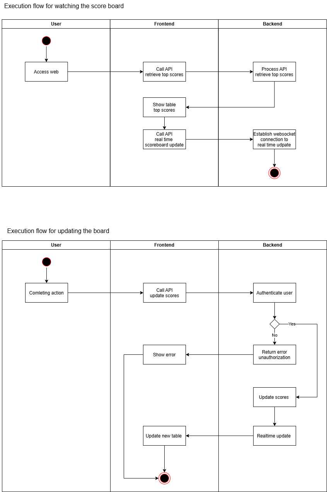

# Scoreboard API Module Specification

## Overview
This document specifies the design and functionality of the API module responsible for managing the scoreboard in our system. This module will handle updating user scores, retrieving top scores, and ensuring security against unauthorized modifications.

---

## Features
1. **Retrieve Top Scores** - Fetch the top 10 users based on their scores.
2. **Update User Score** - Securely update a user's score after completing an action.
3. **Real-time Updates** - Provide live scoreboard updates using WebSockets.
4. **Security Measures** - Prevent unauthorized score modifications using authentication and validation mechanisms.

---

## API Endpoints

### 1. Retrieve Top Scores
**Endpoint:** `GET /api/scores/top`

**Description:** Returns the top 10 users ranked by score.

**Authentication:** Not required.

**Parameters:** None.

**Example Request:**
```http
GET /api/scores/top
```

**Example Response:**
```json
{
  "scores": [
    { "username": "user1", "score": 1500 },
    { "username": "user2", "score": 1400 }
  ]
}
```

**Status and Errors:**
- `200 OK`: Successfully retrieved top scores.
- `500 Internal Server Error`: Database connection issues.

**Error Messages:**
- `500 Internal Server Error`: "Failed to fetch scores. Please try again later."

**Improvements:**
- Implement **caching** (e.g., Redis) to reduce database load and improve response time.
- Use **pagination** for scalability when handling a large number of users.

---

### 2. Update User Score
**Endpoint:** `POST /api/scores/update`

**Description:** Updates the score for a user when they complete an action.

**Authentication:** Required via JWT or OAuth.

**Parameters:**
- `userId` (String, required): Unique identifier of the user.
- `actionId` (String, required): Identifier of the action performed.
- `authToken` (String, required): Authentication token.

**Example Request:**
```http
POST /api/scores/update
Content-Type: application/json
{
  "userId": "12345",
  "actionId": "67890",
  "authToken": "abcd1234"
}
```

**Example Response:**
```json
{
  "success": true,
  "newScore": 1550
}
```

**Status and Errors:**
- `200 OK`: Score updated successfully.
- `400 Bad Request`: Missing or invalid parameters.
- `401 Unauthorized`: Invalid or expired authentication token.
- `403 Forbidden`: User does not have permission to update scores.
- `500 Internal Server Error`: Database or server issues.

**Error Messages:**
- `400 Bad Request`: "Invalid request parameters."
- `401 Unauthorized`: "Authentication failed. Please log in."
- `403 Forbidden`: "You are not allowed to update scores."
- `500 Internal Server Error`: "An unexpected error occurred."

**Improvements:**
- Implement **rate limiter** to prevent excessive requests.
---

### 3. Real-time Scoreboard Updates
**Technology:** WebSockets

**Authentication:** Required via JWT.

**Parameters:** None.

**Example Connection:**
```javascript
const socket = new WebSocket("ws://api.example.com/scores/live");
socket.onmessage = (event) => {
  console.log("New score update:", event.data);
};
```

**Example Response:**
```json
{
  "username": "user1",
  "newScore": 1600
}
```

**Status and Errors:**
- `101 Switching Protocols`: Connection established successfully.
- `401 Unauthorized`: Invalid authentication.
- `500 Internal Server Error`: Server issues.

**Error Messages:**
- `401 Unauthorized`: "Invalid token. Connection refused."
- `500 Internal Server Error`: "WebSocket connection failed."

---

## Execution Flow
### Watching the scoreboard when access the web
1. **User Access the web:**
   - The frontend sends a request to `GET /api/scores/top`.
2. **Server process API:**
   - The backend process API then return the score board dataor frontend to visualize.
3. **Frontend and backend establish realtime update connection:**
   - Frontend call API to establish websocket with backend for real time updating.
### Updating the score board
1. **User Completes Action:**
   - The frontend sends a request to `POST /api/scores/update` with a valid `authToken`.
2. **Server Validates Request:**
   - Authenticates the user.
   - (Optional) Checks user permissions.
3. **Update Score in Database:**
   - The new score is computed and stored.
4. **Send Real-time Update:**
   - Notify all subscribed clients via WebSockets.

## Execution Flow Diagram

